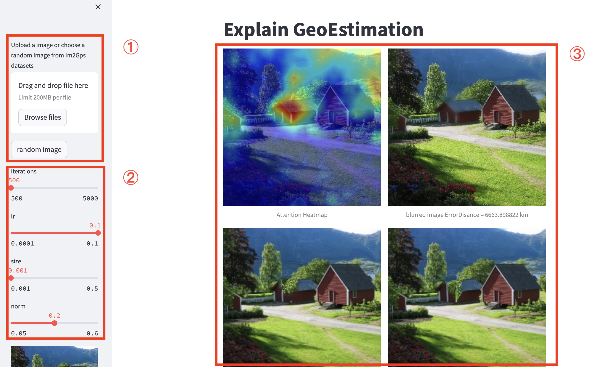

# GeoExplain-demo
A tool based on interpretable AI to blur specify region of image for person privacy.



## Features
- quick start
    ```
    pip install requirments.txt
    streamlit run demo.py
    ```
1. Upload image: Support for processing user photos with exif information
2. Adjust parameters: Adjust parameter like lr, mask size, iteration for optimization.
3. Visulizable result: heatmap, map location

## TODO
- complete and test requirements.txt
- improve visulize results

## Acknowledge
This work is based on the following projects:

- https://github.com/jacobgil/pytorch-explain-black-box
- https://github.com/Janspiry/Palette-Image-to-Image-Diffusion-Models
