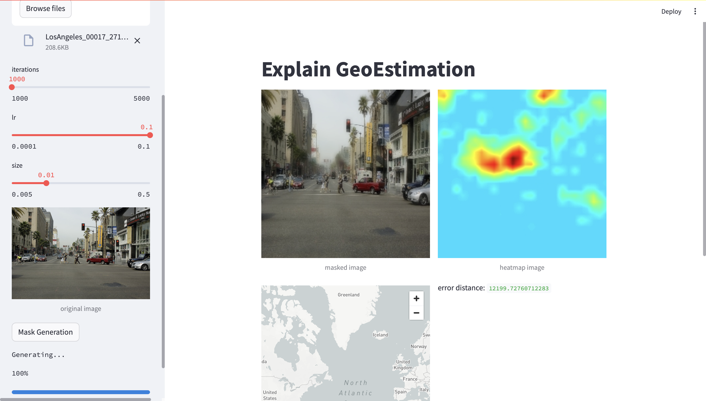

# GeoExplain-demo
A tool based on interpretable AI to blur specify region of image for person privacy.


## Features
- quick start
    ```
    pip install requirments.txt
    streamlit --run demo.py
    ```
- Adjust parameters: Adjust parameter like lr, mask size, iteration for optimization.
- Visulizable result: heatmap, map location

## TODO
- complete and test requirements.txt
- datasets download file and choose image function
- improve visulize results

## Acknowledge
This work is based on the following projects:

- https://github.com/jacobgil/pytorch-explain-black-box
- https://github.com/Janspiry/Palette-Image-to-Image-Diffusion-Models
